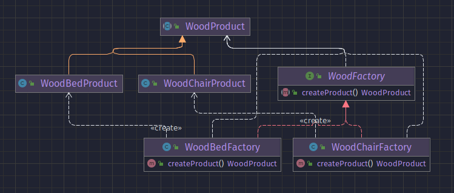

## Intencion
se define una interfaz para la creacion de objetos. dejando que cada subclass decida que clase va a instanciar.
De esa forma tenemos clases instanciadas abstractas

Es recomendable usarlo cuando se requiere la creacion de objetos complejos. No es necesario usar este patron cuando
el objeto se crea con un simple **new**.
## Tambien comocido como
Virtual constructor
## Motivacion 
Los frameworks usan clases abstractas para definir y mantener relaciones entre objetos. un framework es a menudo 
responsable de crear estos objetos también
## Cuando aplicar
* una clase no puede anticipar la clase de objetos que debe crear
* una clase quiere que sus subclases especifiquen los objetos que crea
* las clases delegan la responsabilidad a una de varias subclases auxiliares, y desea localizar el conocimiento de qué suclases auxiliares es el delegado
## Participantes
* **Product**
  * define la interface de objectos que el factory method crea.
  * interfaz de clase de producto, utilizada para estandarizar las clases de productos
* **ConcreteProduct**
  * implementan el Product interface, pueden ser muchas clases.
* **Creator**
  * declara el método de fábrica, que devuelve un objeto de tipo **Product**.
* **ConcreteCreator**
  * sobre escribe el factory method para retornar una instancia de un **ConcreteProduct** 
## Colaboracion
  * el **Creator** confia en sus subclasses para definir el metodo de fabricacion, para que devuelva una instancia del **ConcreteProduct** apropiado
## Consecuancias
una desventaja potencial de los métodos factoty es que los clientes podrían tener que crear una 
subclase de la clase creadora solo para crear un objeto de producto concreto en particular.
la subclasificación está bien cuando el cliente tiene que subclasificar la clase creadora de todos modos,
pero de lo contrario, el cliente ahora debe lidiar con otro punto de evolución

## UML

